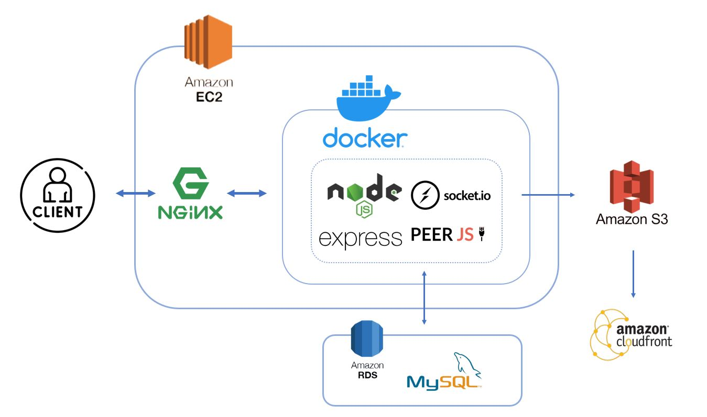

# [LET'S CHAT](https://message-test.xyz/)

**"LET’S CHAT" integrates various interactive methods, including text, voice, and multimedia sharing, enabling users to effortlessly engage with others and foster a closer social network.**

<!-- 放個基本的畫面圖 -->

---

### Test Account

- Email：test@gmail.com
- Password：test1234

# Architecture

# Main Features

- Developed using Node.js and Express
- Utilized Socket.io and peer.js for real-time text and voice communication
- Stored data in the MySQL database within RDS, employing connection pooling, and implemented database normalization to enhance processing
- Stored images in S3 and accelerated file distribution using CloudFront
- Built a Docker image and deployed it on EC2
Utilized NGINX for reverse proxy

<!-- 資料庫設計 -->

# Technique Overview

- Backend
    - Node.js(Express)
    - Socket.IO
    - WebRTC(PeerJS)
    - Nginx
    - RESTful API
    - JWT
    - Git, GitHub

- Deployment
    - Docker
    - AWS EC2, S3, RDS, CloudFront

- Frontend
    - HTML
    - CSS
    - JavaScript
    - AJAX

# Contact

- Alice Chang
- E-mail：comenta0415@gmail.com
<!-- - Linkedin：https://www.linkedin.com/in/alice-chang-1a564b274/ -->